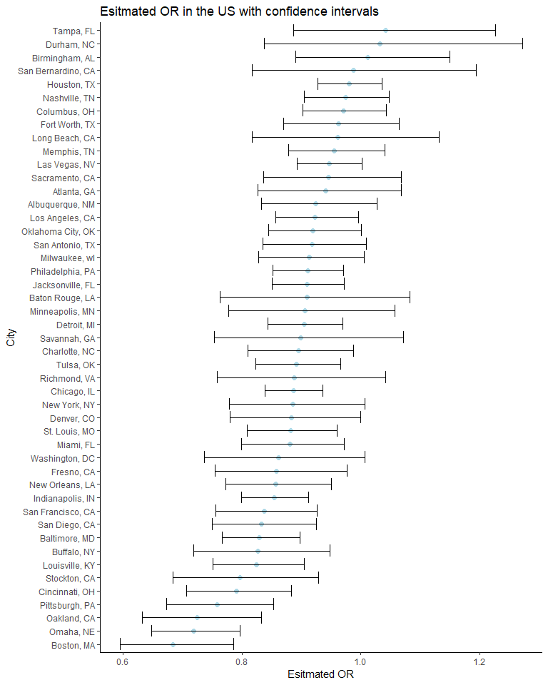
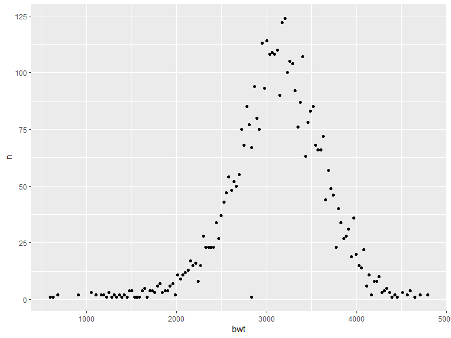
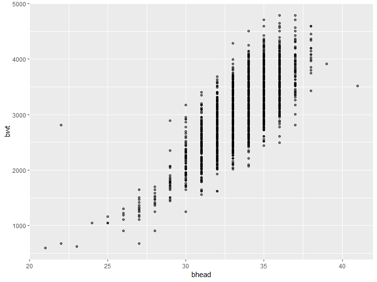
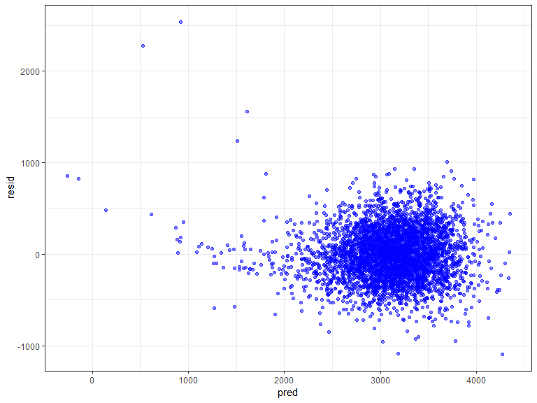
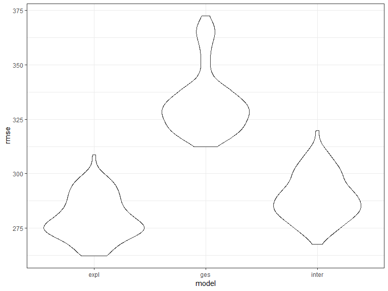

p8105\_hw6
================
Jiawei Ye

### Problem 1

This problem focuses on the homicide data gathered by Washington Post.

Some tidying includes the new `city_state` variable, binary variable `solve_bi` with 0 for unsolved and 1 for solved. Omitted the four cities, modified the `victim_race`, and ensured `victim_age` is numeric. When the race of a victim is unknown, it is considered "non white".

``` r
homi = read.csv("./data/homicide-data.csv") %>% 
  unite(city, state, col = "city_state", sep = ", ") %>% 
  mutate(solve_bi = 
           ifelse(disposition %in% c("Closed without arrest", "Open/No arrest"), 0, 1)) %>% 
  filter(city_state != "Dallas, TX" & city_state != "Phoenix, AZ" &
         city_state != "Kansas City, MO" & city_state != "Tulsa, AL") %>% 
  mutate(victim_race = ifelse(victim_race == "White", "white", "non-white"), 
         victim_race = as.factor(victim_race), 
         victim_race = relevel(victim_race, "white"), 
         victim_age = as.numeric(victim_age),
         city_state = as.factor(city_state))
```

The logistic regression.

``` r
homi_log_fit = 
  homi %>% 
  filter(city_state == "Baltimore, MD") %>% 
  glm(solve_bi ~ victim_age + victim_sex + victim_race, data = .)

homi_log_fit %>% broom::tidy()
```

    ## # A tibble: 4 x 5
    ##   term                  estimate std.error statistic  p.value
    ##   <chr>                    <dbl>     <dbl>     <dbl>    <dbl>
    ## 1 (Intercept)           0.747     0.0507       14.7  1.86e-47
    ## 2 victim_age           -0.000834  0.000674     -1.24 2.16e- 1
    ## 3 victim_sexMale       -0.212     0.0315       -6.72 2.23e-11
    ## 4 victim_racenon-white -0.187     0.0400       -4.69 2.88e- 6

OR for solving homicides comparing non-white victims to white victims keeping all other variables fixed.
And CI

``` r
homi_log_fit %>% 
  broom::tidy() %>% 
  mutate(or_estimate = exp(estimate), 
         ci_low = exp(estimate - 1.96 * std.error),
         ci_high = exp(estimate + 1.96 * std.error)) %>% 
  select(term, or_estimate, ci_low, ci_high) %>% 
  filter(term == "victim_racenon-white")
```

    ## # A tibble: 1 x 4
    ##   term                 or_estimate ci_low ci_high
    ##   <chr>                      <dbl>  <dbl>   <dbl>
    ## 1 victim_racenon-white       0.829  0.767   0.897

OR for every city.
There is unreasonable value for `victim_sex` variable, which is "Pittsburg". This observation is dropped from the data, but unknown victim gender is not removed.

``` r
glm_ci = function(df){
  glm(solve_bi ~ victim_age + victim_sex + victim_race, data = df) %>% 
  broom::tidy() %>% 
  mutate(or_estimate = round(exp(estimate), digits = 3), 
         ci_low = round(exp(estimate - 1.96 * std.error), digits = 3),
         ci_high = round(exp(estimate + 1.96 * std.error), digits = 3)) %>% 
  select(term, or_estimate, ci_low, ci_high) %>% 
  filter(term == "victim_racenon-white")
}

homi_nest = homi %>%
  select(city_state, solve_bi, victim_age, victim_sex, victim_race) %>%
  filter(victim_sex %in% c("Female", "Male", "Unknown")) %>% 
  nest(solve_bi:victim_race, .key = data) %>% 
  mutate(glm = map(data,  glm_ci)) %>% 
  select(city_state, glm) %>% 
  unnest()
```

And the plot.

``` r
homi_nest %>% 
  ggplot(aes(x = fct_reorder(city_state, or_estimate), y = or_estimate)) +
  geom_point(color = "light blue", size = 2) +
  geom_errorbar(aes(ymin = ci_low, ymax = ci_high)) +
  coord_flip() +
  labs(title = "Esitmated OR in the US with confidence intervals", 
       x = "City", 
       y = "Esitmated OR") +
  theme_classic()
```



The majority of the cities has less than 1 OR for solving homicides comparing non-white victims to white victims keeping all other variables fixed. However many of these cities have CIs that includes 1.0, indicating not statistically significant results. Some cities such as Tampa, Durham has OR larger than 1, but their CIs included 1, indicating not statistically significant results.

##### Problem 2

Load data. Convert variables for baby sex, father race, malformation, mother race to factor variables.

``` r
birth = read.csv("./data/birthweight.csv")
str(birth)
```

    ## 'data.frame':    4342 obs. of  20 variables:
    ##  $ babysex : int  2 1 2 1 2 1 2 2 1 1 ...
    ##  $ bhead   : int  34 34 36 34 34 33 33 33 36 33 ...
    ##  $ blength : int  51 48 50 52 52 52 46 49 52 50 ...
    ##  $ bwt     : int  3629 3062 3345 3062 3374 3374 2523 2778 3515 3459 ...
    ##  $ delwt   : int  177 156 148 157 156 129 126 140 146 169 ...
    ##  $ fincome : int  35 65 85 55 5 55 96 5 85 75 ...
    ##  $ frace   : int  1 2 1 1 1 1 2 1 1 2 ...
    ##  $ gaweeks : num  39.9 25.9 39.9 40 41.6 ...
    ##  $ malform : int  0 0 0 0 0 0 0 0 0 0 ...
    ##  $ menarche: int  13 14 12 14 13 12 14 12 11 12 ...
    ##  $ mheight : int  63 65 64 64 66 66 72 62 61 64 ...
    ##  $ momage  : int  36 25 29 18 20 23 29 19 13 19 ...
    ##  $ mrace   : int  1 2 1 1 1 1 2 1 1 2 ...
    ##  $ parity  : int  3 0 0 0 0 0 0 0 0 0 ...
    ##  $ pnumlbw : int  0 0 0 0 0 0 0 0 0 0 ...
    ##  $ pnumsga : int  0 0 0 0 0 0 0 0 0 0 ...
    ##  $ ppbmi   : num  26.3 21.3 23.6 21.8 21 ...
    ##  $ ppwt    : int  148 128 137 127 130 115 105 119 105 145 ...
    ##  $ smoken  : num  0 0 1 10 1 0 0 0 0 4 ...
    ##  $ wtgain  : int  29 28 11 30 26 14 21 21 41 24 ...

``` r
sum(is.na(birth))
```

    ## [1] 0

``` r
birth = birth %>% 
  mutate(babysex = as.factor(babysex), 
         frace = as.factor(frace),
         malform = as.factor(malform),
         mrace = as.factor(mrace)) 
```

The code shows that the data set do not contain missing values.

Let's see how the data looks like

``` r
birth %>% 
  group_by(bwt) %>% 
  summarize(n = n()) %>% 
  ggplot(aes(x = bwt, y = n)) +
  geom_point()
```



``` r
birth %>% 
  ggplot(aes(x = bhead, y = bwt)) +
  geom_point(alpha = .5)
```



``` r
expl_model = 
  lm(bwt ~ bhead + blength + babysex  + frace + mrace + wtgain, data = birth) 
```

Not too surprisingly, birth weight looks normal. Seems like there's some relationship between head circumference and birth weight. Also I think the race the parents, gender of the baby, mother's weight gain are associated with baby's birth weight.Therefore I build a model as above.

``` r
birth %>% 
  add_predictions(expl_model) %>% 
  add_residuals(expl_model) %>% 
  ggplot(aes(x = pred, y = resid)) +
  geom_point(alpha = 0.5, color = "blue") +
  theme_bw()
```

 There are some outliers for the under weight newborns, but for the fitted values around 3 kilograms, the residuals are more or less evenly distributed around 0 line, but not really perfect.

Other specified models.

``` r
ges_model = lm(bwt ~ blength + gaweeks, data = birth)
interaction_model = lm(bwt ~ bhead + blength + babysex +
                             bhead * blength + bhead * babysex + blength * babysex + 
                             bhead * blength * babysex, 
                             data = birth)
```

Compare the models.

``` r
cv_df = crossv_mc(birth, 100)
cv_df = cv_df %>% 
  mutate(expl_m  = map(train, ~lm(bwt ~ bhead + blength + babysex  + frace + mrace + wtgain, data = .x)), 
         ges_m   = map(train, ~lm(bwt ~ blength + gaweeks, data = .x)), 
         inter_m = map(train, ~lm(bwt ~ bhead + blength + babysex +
                                        bhead * blength + bhead * babysex + blength * babysex + 
                                        bhead * blength * babysex, data = .x))) %>% 
  mutate(rmse_expl  = map2_dbl(expl_m, test, ~rmse(model = .x, data = .y)), 
         rmse_ges   = map2_dbl(ges_m, test, ~rmse(model = .x, data = .y)),
         rmse_inter = map2_dbl(inter_m, test, ~rmse(model = .x, data = .y)))

  
cv_df %>% 
  select(starts_with("rmse")) %>% 
  gather(key = model, value = rmse) %>% 
  mutate(model = str_replace(model, "rmse_", ""),
         model = fct_inorder(model)) %>% 
  ggplot(aes(x = model, y = rmse)) + 
  geom_violin() +
  theme_bw()
```



It turns out that my model has the smallest root mean square error. My model has 6 variables and is not the best in terms of parsimony. The model with gestational age in weeks and length at birth has a rather high root mean square error indicating a not very good fit. The model using head circumferences, length, sex and all the interaction is a bit complicated but has aceptable goodness of fit.
